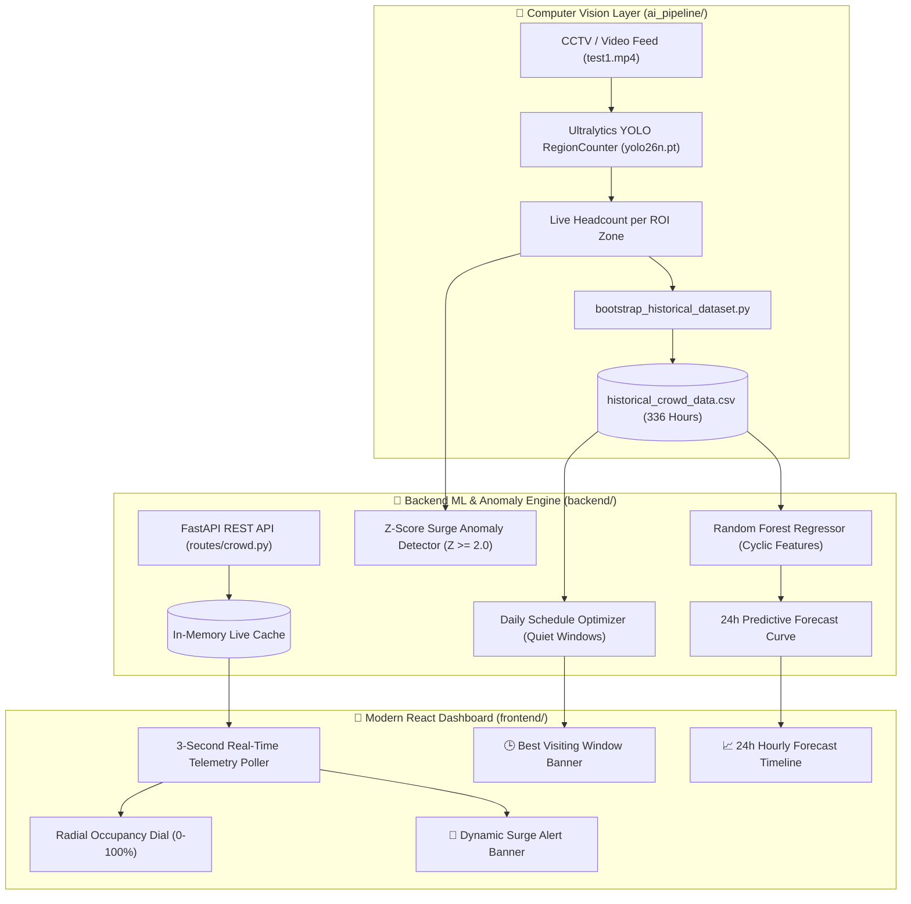

# YatraSetu: Cross-Device Deployment & Live Verification Plan

This document is a self-contained, shareable implementation and run guide for setting up and demonstrating the **YatraSetu AI Crowd Analytics & ML Anomaly Prediction Ecosystem** on any machine (Windows, macOS, Linux).

---

## 1. System Architecture Overview



---

## 2. Prerequisites

Ensure the destination device has the following runtimes installed:
- **Python**: Version `3.10` or higher ([python.org](https://www.python.org/))
- **Node.js**: Version `18.x` or higher ([nodejs.org](https://nodejs.org/))
- **Git**: Installed and available in terminal

---

## 3. Step-by-Step Setup Guide

### Step 1: Clone the Repository
```bash
git clone https://github.com/rishikeshasani/Yatrasetu.git
cd Yatrasetu
```

### Step 2: Install Backend Dependencies
```bash
cd backend
pip install -r requirements.txt
cd ..
```
> [!NOTE]
> Installs `fastapi`, `uvicorn`, `scikit-learn`, `pandas`, `numpy`, `ultralytics`, and `opencv-python`.

### Step 3: Install Frontend Dependencies
```bash
cd frontend
npm install
cd ..
```

---

## 4. How to Launch the Application

### Option A: 1-Click Launchers (Windows)
1. Double-click `backend/run_backend.bat` ➔ Starts FastAPI backend on port `8000`.
2. Double-click `frontend/run_frontend.bat` ➔ Starts Vite frontend on port `5173`.

---

### Option B: Command Line (Windows / macOS / Linux)

#### Terminal 1: Backend Server
```bash
cd backend
uvicorn main:app --reload --port 8000
```
- **API Swagger Documentation**: [http://localhost:8000/docs](http://localhost:8000/docs)

#### Terminal 2: Frontend Dashboard
```bash
cd frontend
npm run dev
```
- **Live React Web App**: [http://localhost:5173](http://localhost:5173)

---

## 5. Live Demonstration & Verification Workflow (For Judges / Evaluators)

To prove that the platform processes **dynamic real-time data** and is not hardcoded:

### Step 1: Open the Frontend
Open **[http://localhost:5173](http://localhost:5173)** in your browser side-by-side with your terminal.

### Step 2: Run the Live Streamer
In a third terminal window:
```bash
python live_demo_streamer.py
```

### 👁️ What Happens Live on the Screen:
1. **Dynamic Dial Updates**: The circular dial and pilgrim headcount animate in real time as video counts stream every 2.5s (`960` $\to$ `1320` $\to$ `2450`).
2. **Real-Time Anomaly Alarm**: When the sudden spike of 2,450 visitors is injected, the top monitor bar turns **Red** and triggers:
   > **`🚨 Dynamic Surge Anomaly: CRITICAL SURGE DETECTED (+244900% above historical baseline)`**
3. **Queue Recalculation**: Estimated wait time shifts dynamically based on incoming crowd density.
4. **24-Hour ML Forecast**: The bottom timeline displays predicted hourly distributions generated by the Random Forest model.

---

## 6. API Reference Table

| Method | Endpoint | Description |
| :--- | :--- | :--- |
| `POST` | `/crowd/update` | Ingests live video counts and returns dynamic relative surge evaluation |
| `GET` | `/sites/{id}/density` | Returns current headcount, occupancy percentage, and live surge state |
| `GET` | `/sites/{id}/forecast` | Returns 24-hour predictive forecast curve generated by Random Forest |
| `GET` | `/sites/{id}/schedule-insights` | Computes quiet visiting windows (*"Generally free during 7–10 AM"*) |
| `GET` | `/sites/{id}/relative-surge` | Checks current footfall against historical $(day, hour)$ $Z$-score |

---

## 7. Zero-Cloud Resilience (Offline Mode)

- **No Supabase Account Required**: If `.env` credentials are not present, the backend automatically activates an in-memory client and local caching.
- **Cross-Platform Path Resolution**: All paths use dynamic `pathlib.Path(__file__)` references, avoiding OS-specific hardcoded paths.
- **Frontend Fallback Safety**: If the backend is temporarily offline, the frontend seamlessly renders baseline statistical curves and interactive anomaly triggers without crashing.
